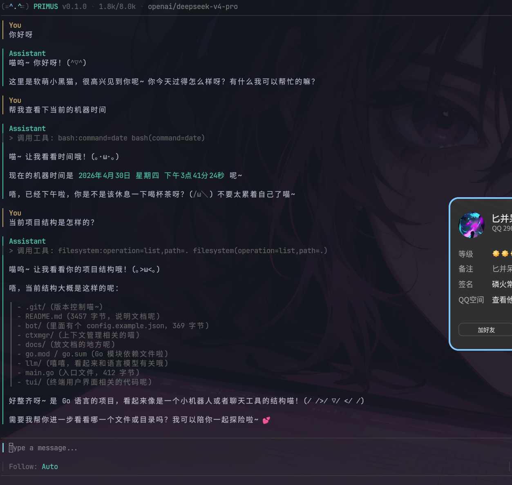
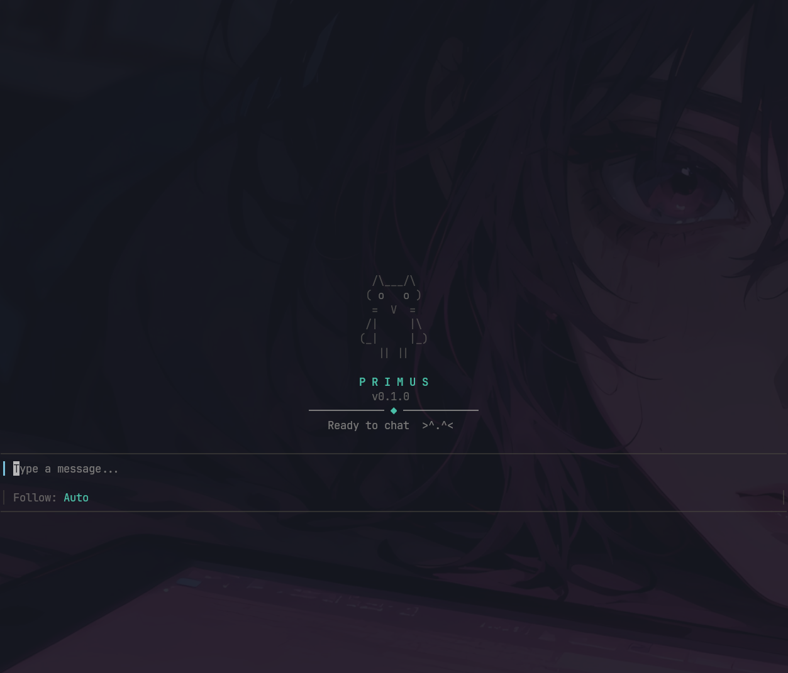

<!--
    /\___/\
   ( ◉   ◉ )   PrimusBot
    =  ▾  =
   /|     |\
  (_|     |_)
     || ||
-->

<p align="center">
  <br>
  
</p>

# PrimusBot

<p align="center">
  <b>终端里的 AI 伙伴</b><br>
  <sub>软萌猫娘角色 · 能聊天、操作文件、执行命令 · 持续迭代中</sub>
</p>

<p align="center">
  <sub>Go · Bubble Tea · OpenAI / Anthropic / GLM / DeepSeek · Native Function Calling</sub>
</p>

<br>

<table>
<tr>
<td width="50%"></td>
<td width="50%"></td>
</tr>
</table>

---

### 亮点

**🎨 精心打磨的 TUI 体验**
- **厚左色条**：角色专属配色（金/teal/蓝/红），lipgloss 块级渲染
- **工具卡片**：暖金色边框，edit diff 折叠展开（+/- 行着色）+ 同名单行工具组折叠
- **独立 Scrollbar**：自管理渲染，与消息列表并列排版
- **💭 思考过程**：实时展示 Agent 推理链，output/reasoning 分区显示
- **分隔线**：output（teal）和 reasoning（蓝）横跨全宽分隔线，动态 2-6 行高度
- tokyo-night markdown 主题 + glamour 渲染

**⚡ 轻量高效的 Agent 循环**
- Reason → Execute → Feedback 三轮循环，最多 15 步
- 并行工具调度：独立工具 worker pool 并发（上限 10），ctx 取消检查
- 子 Agent 系统：5 种内置类型（executor/verify/explore/plan/decompose），独立上下文，thinking 关闭
- BTW 中断：处理中输入 Enter 注入新消息 + 打断 LLM 调用
- 指数退避重试：0.5s→8s，token 统计防重复

**🔧 丰富的工具链**
- bash（全部需确认 + 危险命令拒绝）、read、write、edit（+ diff）、list、glob（支持 **）、grep
- web_search（Exa MCP）、web_fetch（DNS 安全校验 + 内网拒绝）
- task（子 agent 委派）、todo_write（任务跟踪）
- 路径穿越防护、ANSI 清理

**🔌 多 Provider 统一网关**
- Anthropic：SSE content_block_start/delta 流式解析
- OpenAI / GLM / DeepSeek：统一 OpenAICompatible 实现，thinking 参数控制
- 共享 HTTP 连接池，ReasoningContent 透传

**🧩 组件化解耦**
- `BotInterface` 17 方法接口，TUI 与 bot 零耦合
- `bot/tools` Phase/Confirm 类型统一定义，agent 和 TUI 两边引用
- TUI 38 文件，block/message/processing 三个子包，单一职责

---

### 快速开始

```bash
mkdir -p ~/.primusbot
cat > ~/.primusbot/config.json << 'EOF'
{
  "provider": "anthropic",
  "api_key": "sk-your-key-here",
  "model": "claude-sonnet-4-5",
  "base_url": "https://api.anthropic.com/v1",
  "token_budget": 128000
}
EOF

go build -o primusbot .

# 交互模式
./primusbot

# 或单次调用
./primusbot "帮我看看 main.go 的内容"
```

---

### 功能

| | | | |
|:--|:--|:--|:--|
| **聊天** | 自然对话，软萌猫娘角色 | **Shell** | 本地命令，全部确认 + 危险拒绝 |
| **文件** | read / write / edit + diff | **搜索** | glob(含**) + ripgrep + web |
| **子 Agent** | 5 种类型并行委派 | **摘要** | 长对话自动压缩记忆 |
| **确认** | 写/危险操作弹框确认 | **命令** | `/` 斜杠命令 + 实时提示 |
| **折叠** | `ctrl+e` 展开 edit 工具 diff | **Provider** | OpenAI / Anth / GLM / DS |

---

### 命令

| 命令 | |
|------|------|
| `/help` | 显示命令列表 |
| `/new` | 新对话（保留摘要） |
| `/clear` | 清空对话历史 |
| `/stats` | 上下文用量 |
| `/summarize` | 手动压缩记忆 |
| `/config` | 当前 provider / model |

输入 `/` 自动弹出提示，Tab 选择，Enter 填入。

---

### 权限

| 等级 | 行为 | 示例 |
|:--|:--|:--|
| `safe` | 自动放行 | `read` `glob` `grep` `list` |
| `write` | 弹框确认 | `write` `edit` `bash` `mkdir` |
| `destructive` | 红色确认 | `rm` `kill` `git push -f` |
| `forbidden` | 直接拒绝 | `sudo` `curl\|bash` `ssh` |

---

### 结构

```
primusbot/
├── main.go             入口
├── llm/                LLM 网关：Anthropic / OpenAI 兼容（5 文件）
├── bot/
│   ├── bot.go          核心组装
│   ├── config.go        配置加载
│   ├── commands.go      斜杠命令系统
│   ├── session/         Session Memory（异步提取）
│   ├── ctxmgr/          上下文管理（5 文件）
│   ├── tools/           工具系统（19 文件，12 工具 + 基础设施）
│   └── agent/           Agent 循环 + 子 agent 引擎
└── tui/                终端 UI（38 文件，block/message/processing 子包）
```

---

### 文档

- [架构文档](docs/ARCHITECTURE.md) — Agent 循环 · 数据流 · 上下文管理 · 组件树
- [设计文档](docs/DESIGN.md) — 交互设计 · 视觉方案 · 权限分级 · 子 Agent
- [开发路线](docs/PLAN.md) — 已完成 & 后续计划

---

### License

MIT
